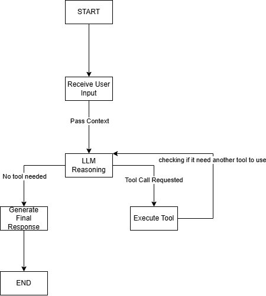

# Local Agentic Horticulture Tracker 🌿

An autonomous, local-first AI agent designed to track indoor horticulture metrics, including cold-stratification timelines, ericaceous soil pH validation, and transplant-shock recovery. 

This project demonstrates the implementation of a cyclic LangGraph reasoning engine communicating with a FastMCP tool server, powered entirely by a local offline LLM.

## 🧠 System Architecture & Workflow

The agent operates on a continuous reasoning loop, evaluating user input to determine if external tool execution is required before generating a final response.

### Workflow Breakdown:
1. **Receive User Input:** The human query is passed to the LangGraph state machine.
2. **LLM Reasoning (The Brain):** The local model (Qwen2.5) evaluates the context against the system prompt.
3. **Tool Call Execution:** If the LLM determines a tool is needed (e.g., logging stratification), it pauses generation, triggers the FastMCP server, and waits for structured data.
4. **Context Update:** The tool's output is fed back into the reasoning loop.
5. **Generate Final Response:** Once all necessary data is gathered, the LLM synthesizes a final, human-readable response.

## 🛠️ Tech Stack
* **Framework:** LangGraph (State Machine / Agent Loop)
* **Tooling Protocol:** FastMCP (Model Context Protocol)
* **Local LLM:** Ollama (qwen2.5)
* **Language:** Python 3.11+
* **Validation:** Pydantic (Strict schema enforcement)

## 🚀 Quick Start
*(Add your installation and run instructions here, like `conda activate 1_agent_env` and `python main.py`)*